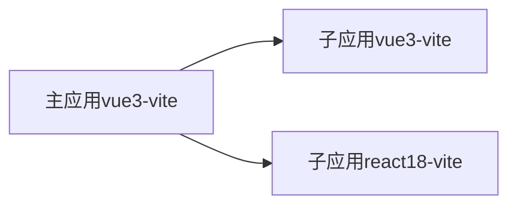

# qiankun-vite-monorepo demo

[qiankun](https://github.com/umijs/qiankun)(v2.x) demo, 使用了[vite-plugin-qiankun](https://github.com/tengmaoqing/vite-plugin-qiankun) 插件

```mermaid
graph LR
A[主应用vue3-vite] 
--> B[子应用vue3-vite]
A--> C[子应用react18-vite]
```
