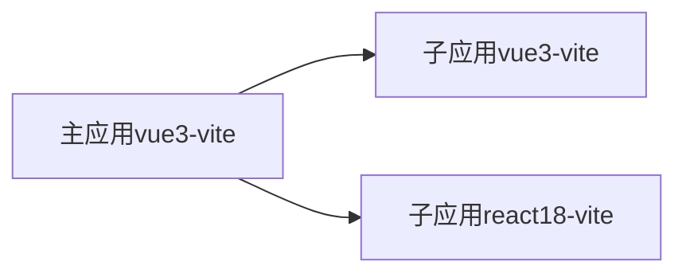

# qiankun-vite-monorepo demo

[qiankun](https://github.com/umijs/qiankun)(v2.x) demo, 使用了[vite-plugin-qiankun](https://github.com/tengmaoqing/vite-plugin-qiankun) 插件



## Project Setup

```sh
pnpm install
```

### Compile and Hot-Reload for Development

```sh
pnpm dev
```

### Type-Check, Compile and Minify for Production

```sh
pnpm build
```

## 注意事项

### 路由与部署

- 约定匹配 `/micro-*` 动态路由都为子应用
- 约定子应用配置的 `viteConfig.base` 对应主应用配置的 `activeRule: 'micro-${base}'`
- 子应用 `viteConfig.server` 配置应匹配对应的 `entry`, 且允许跨域 `cors: true`
- 约定部署时主应用与子应用应在同一个域名下 每个子应用都要单独配置 `nginx`

例如主应用部署在 `https://www.app.com/main`, 子应用 vue-project 应部署在 `https://www.app.com/main/${base}`, 也就是 `https://www.app.com/main/vue`

```typescript
// 主应用
import { registerMicroApps, start } from 'qiankun'

const microApps = [
  {
    name: 'vue-project',
    /** 主应用 触发加载子应用的路由 */
    activeRule: 'micro-vue',
    /** 子应用 dev url */
    entry: '//localhost:3000',
    /** 子应用 viteConfig.base */
    base: "vue"
  },
  {
    name: 'react-project',
    entry: '//localhost:3001',
    activeRule: 'micro-react',
    base: "react"
  }
]

if (import.meta.env.MODE === "production") {
  microApps.forEach(item => {
    // 部署时替换子应用入口
    item.entry = window.origin + import.meta.env.BASE_URL + item.base
  })
}

registerMicroApps(microApps)
// 启用 sandbox 隔离样式
start({ sandbox: { strictStyleIsolation: true } })
```

## 遇到的问题

### 样式隔离与js沙箱

`qiankun`v2.x 不支持 `vite`, 即使使用了 `vite-plugin-qiankun` 仍有问题

- 子应用会影响到主应用 (JS effect / CSS) (子应用使用 `vite-plugin-qiankun` 提供的 `qiankunWindow` JS effect 不会逃逸)
- 在生产环境 子应用样式影响会随子应用卸载而重制（但 `vite` 子应用 开发环境不会重制）
- 即使开启`sandbox: { strictStyleIsolation: true }` 后生产环境会隔离样式，（但 `vite` 子应用 开发环境依旧如上）
